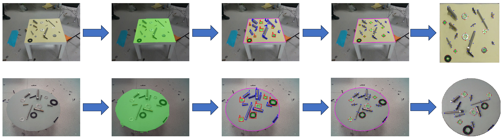
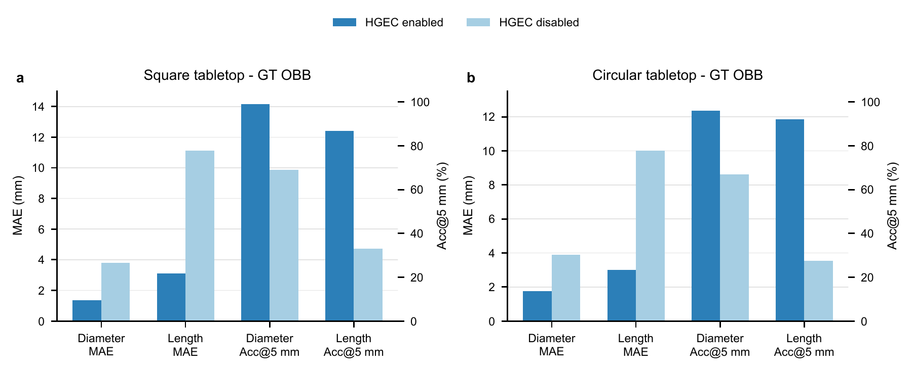

# Industry_detect

## Tabletop-Referenced Visual Metrology for Coarse-Grained Sorting of Metallic Fasteners

**Measure bolts and washers in millimeters from oblique RGB-D views, using the tabletop as the metric reference.**

This repository accompanies the manuscript above and provides dataset access, method illustrations, and experimental documentation. The framework targets **candidate screening and coarse-grained pre-sorting** with a low-cost RGB-D camera, and connects dimension and position estimates to an existing robot workflow.

[Dataset](#dataset) · [Real-robot demonstration](#real-robot-demonstration) · [Method](#method) · [Results](#results) · [Experimental details](docs/experiments.md)

## Real-robot demonstration


*Top: stages of the UR5 pick-and-place sequence. Bottom: the observed tabletop, geometric localization, and predicted dimensions and positions alongside ground truth.*

A fixed, oblique-view **Astra Pro Plus** camera observes seven bolts on the workbench. The proposed perception interface supplies metric dimensions and tabletop positions to an existing large language model planner and UR5 operation interfaces. The planner generates calling code that connects these interfaces to execute the task.

- **Hardware:** Astra Pro Plus RGB-D camera and UR5 robotic arm.
- **Perception outputs:** bolt length, diameter, and tabletop position in millimeters.
- **Execution:** **7/7 planned pick-and-place operations completed without manual takeover.**
- **Protocol:** target locations, source–target correspondences, and execution order were specified before execution. This is a controlled interface-integration demonstration; the completion count does not measure independent length classification or general robot success rate.

See [per-bolt measurements and demonstration protocol](docs/experiments.md#real-robot-protocol-and-records) for the detailed records.

## Method

Reflective metallic surfaces can produce depth holes and unreliable boundary depth. The framework uses **RGB-derived oriented bounding box (OBB) keypoints** and a **tabletop metric reference** to estimate fastener dimensions, reducing reliance on depth at metal edges.



1. **Recover the tabletop metric domain.** For square tabletops, regularize the segmented quadrilateral and estimate a four-corner homography. For circular tabletops, combine the RGB contour with the aligned point cloud to recover the tabletop plane and circle. Known tabletop dimensions establish metric scale.
2. **Detect fasteners and refine washer holes.** Detect bolt and washer OBBs; use a second-stage region-of-interest detector for washer inner holes.
3. **Construct and project keypoints.** Map OBB-derived structural keypoints into the rectified metric tabletop domain.
4. **Estimate dimensions and positions.** Compute bolt length and diameter, washer outer and inner diameters, and tabletop-referenced centers.
5. **Apply hierarchical geometric error correction (HGEC).** Compensate for bolt geometry above the tabletop through diameter, height-related center, length, and additional center corrections in the **D → H → L → C** sequence. The corrected diameter supplies the geometric scale for subsequent corrections. Washers use their own dimension branch without bolt HGEC.

The square-tabletop homography path uses RGB geometry. The circular-tabletop path additionally uses depth for tabletop recovery. Both require an externally supplied tabletop dimension.

## Dataset

### Download

| Resource | Access |
| :--- | :--- |
| Dataset share | **Indust_detect** |
| Baidu Netdisk | [Download the dataset](https://pan.baidu.com/s/1y7ULDZ_ZkiCPOnxc7e2QAQ?pwd=9wq4) |
| Extraction code | **`9wq4`** |

### Dataset described in the manuscript

The detector-training corpus contains **more than 10,000 RGB-D images**. Annotations cover square and circular tabletop masks, external OBBs for bolts and washers, and washer inner-hole OBBs used in ROI refinement. Acquisition includes variations in lighting, backgrounds, and bolt stacking.

The independent quantitative evaluation uses **29 scenes and 565 parts**, separate from detector training:

| Tabletop | Scenes | Bolts | Washers | Total parts |
| :--- | ---: | ---: | ---: | ---: |
| Square | 17 | 197 | 154 | 351 |
| Circular | 12 | 127 | 87 | 214 |
| **Total** | **29** | **324** | **241** | **565** |

Bolt diameters span **6–16 mm** and lengths **10–150 mm**. Washer outer diameters span **12–24 mm** and inner diameters **3–14 mm**. Manual reference measurements were repeated three times by the same operator and averaged.

## Results

### Geometric correction with manual OBBs

Using ground-truth OBBs isolates the geometric measurement stage from detector errors. HGEC reduces bolt length MAE from **11.12 to 3.12 mm** on square tabletops and from **10.01 to 3.01 mm** on circular tabletops.



| Tabletop | Diameter MAE (mm) | Diameter Acc@5 mm | Length MAE (mm) | Length Acc@5 mm |
| :--- | ---: | ---: | ---: | ---: |
| Square | 1.37 | 98.98% | 3.12 | 86.80% |
| Circular | 1.77 | 96.06% | 3.01 | 92.13% |

*Manual OBBs with full HGEC. MAE is mean absolute error; Acc@5 mm is the fraction of results within a 5 mm absolute-error threshold.*

### Predicted OBBs: full-GT evaluation

The following results use the **complete manual ground-truth inventory** as the denominator. Missed detections and invalid metric outputs count as failures, making coverage part of the reported accuracy.

| Measurement | GT instances | Valid outputs | Coverage | Acc@3 mm | Acc@5 mm | Acc@8 mm |
| :--- | ---: | ---: | ---: | ---: | ---: | ---: |
| Bolt diameter | 324 | 309 | 95.37% | 81.17% | 91.98% | 94.75% |
| Bolt length | 324 | 309 | 95.37% | 49.69% | 68.21% | 83.33% |
| Washer outer diameter | 241 | 235 | 97.51% | 70.12% | 89.21% | 95.85% |
| Washer inner diameter | 241 | 235 | 97.51% | 83.82% | 92.95% | 96.27% |

Overall valid metric-output coverage is **544/565 (96.28%)**. This quantity measures measurement availability, rather than detector recall. See [evaluation definitions and complete threshold results](docs/experiments.md#evaluation-protocol).

## Experimental configuration

| Component | Manuscript configuration |
| :--- | :--- |
| RGB-D camera | Astra Pro Plus, fixed oblique view |
| RGB / depth resolution | 640 × 480 / 640 × 480 |
| OBB detector | YOLOv8-OBB, 640-pixel letterboxed input |
| Square tabletop reference | 550 mm side length |
| Circular tabletop reference | 600 mm diameter |
| Rectified metric canvas | 512 × 512 pixels |
| Internal measurement box | γ<sub>l</sub> = 0.9; γ<sub>s</sub> = 0.5 |
| D-branch coefficient | β<sub>d</sub> = 1.04 |
| Robot demonstration | UR5 with the same fixed RGB-D camera |

### Repository contents

```text
Industry_detect/
├── README.md                  # Project overview and dataset access
├── assets/
│   ├── pipeline.png           # Measurement pipeline
│   ├── real_robot_demo.jpg    # UR5 demonstration montage
│   ├── hgec_results.png       # HGEC comparison from the manuscript
│   └── README.md              # Figure provenance
└── docs/
    └── experiments.md         # Evaluation protocol and robot records
```

**Current release:** dataset access and paper project materials. Training, inference, evaluation scripts, model checkpoints, and robot-control code are not included in this repository. The configuration above documents the manuscript experiments.

## Scope

The intended application is coarse-grained measurement and pre-sorting with millimeter-scale tolerances. The system does not replace precision instruments for final inspection within 1 mm. Metric scale depends on known tabletop dimensions; workbench or camera changes require the scale configuration to be supplied again.

Experiments use relatively clean, single-camera tabletop scenes. Strong clutter, occlusion, irregular fasteners, and transfer across RGB-D cameras require additional evaluation. Special bolt viewing configurations can produce long-tail errors in the geometric approximation, and predicted OBB errors can further affect endpoints and positions.

## Associated manuscript

**Tabletop-Referenced Visual Metrology for Coarse-Grained Sorting of Metallic Fasteners**

The figures and reported experiments on this page are drawn from the associated manuscript. A publication link and formal citation are not included in the current release.

For dataset or project questions, use the [repository issue tracker](https://github.com/lqx943576099/Industry_detect/issues).

## License

This repository is intended for open research use. Please check the dataset license or contact the dataset maintainer before commercial use.
