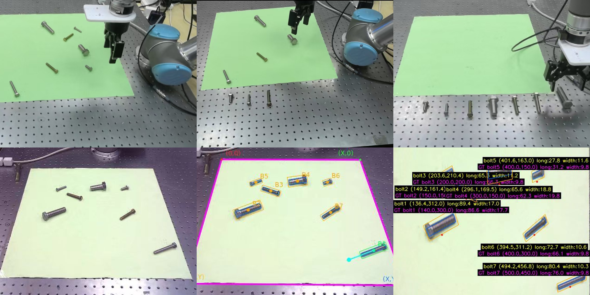

# Experimental Protocol and Real-Robot Records

These records accompany *Tabletop-Referenced Visual Metrology for Coarse-Grained Sorting of Metallic Fasteners* and complement the [project overview](../README.md).

## Evaluation protocol

The evaluation contains 29 independent scenes: 17 square-tabletop scenes and 12 circular-tabletop scenes, with 324 bolts and 241 washers. These scenes are separate from detector training. Each manual reference dimension was measured three times by the same operator and averaged.

- **GT OBB:** manually specified oriented bounding boxes, used to evaluate geometric measurement independently of detection.
- **Predicted OBB:** detector outputs, used to evaluate the measurement pipeline with detection errors.
- **MAE:** mean absolute measurement error, in millimeters.
- **Acc@τ mm:** the proportion of instances whose absolute error is at most τ millimeters.
- **Valid metric-output coverage:** valid metric outputs divided by the full applicable GT inventory.

Results over valid outputs and results over the full GT inventory have different denominators. The table below uses the full GT inventory: missed detections and invalid metric outputs count as failures at every accuracy threshold.

### Full-GT dimension thresholds

| OBB input | Measurement | GT | Valid | Acc@1 mm | Acc@2 mm | Acc@3 mm | Acc@5 mm | Acc@8 mm |
| :--- | :--- | ---: | ---: | ---: | ---: | ---: | ---: | ---: |
| Manual | Bolt diameter | 324 | 324 | 40.74% | 73.46% | 89.20% | 97.84% | 100.00% |
| Manual | Bolt length | 324 | 324 | 25.00% | 44.75% | 57.41% | 88.89% | 94.44% |
| Predicted | Bolt diameter | 324 | 309 | 41.36% | 68.21% | 81.17% | 91.98% | 94.75% |
| Predicted | Bolt length | 324 | 309 | 19.14% | 35.80% | 49.69% | 68.21% | 83.33% |
| Predicted | Washer outer diameter | 241 | 235 | 31.12% | 56.02% | 70.12% | 89.21% | 95.85% |
| Predicted | Washer inner diameter | 241 | 235 | 41.08% | 65.98% | 83.82% | 92.95% | 96.27% |

Bolt results use full HGEC; washer measurements use the washer branch. Valid metric-output coverage is 309/324 for bolts and 235/241 for washers, giving 544/565 overall. Outer and inner washer dimensions refer to the same instance inventory and are not counted twice in overall coverage.

## Real-robot protocol and records

**[Watch the real-robot grasping demo](../assets/real_robot_grasping_demo.mp4)** · [Download the original MP4](https://github.com/lqx943576099/Industry_detect/raw/refs/heads/main/assets/real_robot_grasping_demo.mp4) (63.3 MB)

### Setup and execution

An Astra Pro Plus camera is fixed opposite the UR5 arm at an oblique angle covering the workspace. Seven bolts of different lengths are placed on the tabletop. The measurement interface outputs dimensions and tabletop coordinates; an existing large language model planner generates calling code using the measurement and robot-operation interface definitions.

Seven target locations, source–target correspondences, and the execution sequence are specified in advance. The system completed all **7/7 planned pick-and-place operations without manual takeover**. Side-view phone footage records the trial and is not an input to perception, planning, or control.

This trial tests whether metric perception outputs can be consumed by existing planning and robot interfaces. It is not an independent length-classification benchmark or an estimate of general robot success rate.

### Per-bolt records

All dimensions and coordinates are in millimeters. Slot identifiers are assigned by the predefined task; they are not length bins inferred from predictions. Position error is the Euclidean discrepancy between the predicted tabletop center and its reference center, rather than a robot placement-error measurement.

| Slot | Bolt ID | Predicted length | GT length | Predicted (x, y) | GT (x, y) | Position error |
| ---: | :--- | ---: | ---: | :--- | :--- | ---: |
| 1 | bolt5 | 27.8 | 31.2 | (401.6, 163.0) | (400.0, 150.0) | 13.1 |
| 2 | bolt2 | 43.6 | 45.2 | (149.2, 161.4) | (150.0, 150.0) | 11.4 |
| 3 | bolt3 | 65.3 | 66.3 | (203.6, 210.4) | (200.0, 200.0) | 11.0 |
| 4 | bolt4 | 65.6 | 62.3 | (296.1, 169.5) | (300.0, 150.0) | 19.9 |
| 5 | bolt6 | 72.7 | 66.1 | (394.5, 311.2) | (400.0, 300.0) | 12.5 |
| 6 | bolt7 | 80.4 | 76.0 | (494.2, 456.8) | (500.0, 450.0) | 8.9 |
| 7 | bolt1 | 89.4 | 86.6 | (136.4, 312.0) | (140.0, 300.0) | 12.5 |

## Source mapping

| Project material | Manuscript source |
| :--- | :--- |
| Camera, dataset, and HGEC results | Experimental setup and dimension experiments in `experiment.tex` |
| Full-GT thresholds | Appendix table labeled `tab:app_strict_thresholds` in `appendix.tex` |
| UR5 demonstration | RQ5, labeled `sec:rq5_robot`, in `experiment.tex` |
| Per-bolt records | Appendix table labeled `tab:app_robot_sorting` in `appendix.tex` |

The manuscript source is the reference for these descriptions. The current repository contains the project documentation and figures listed in the README.
